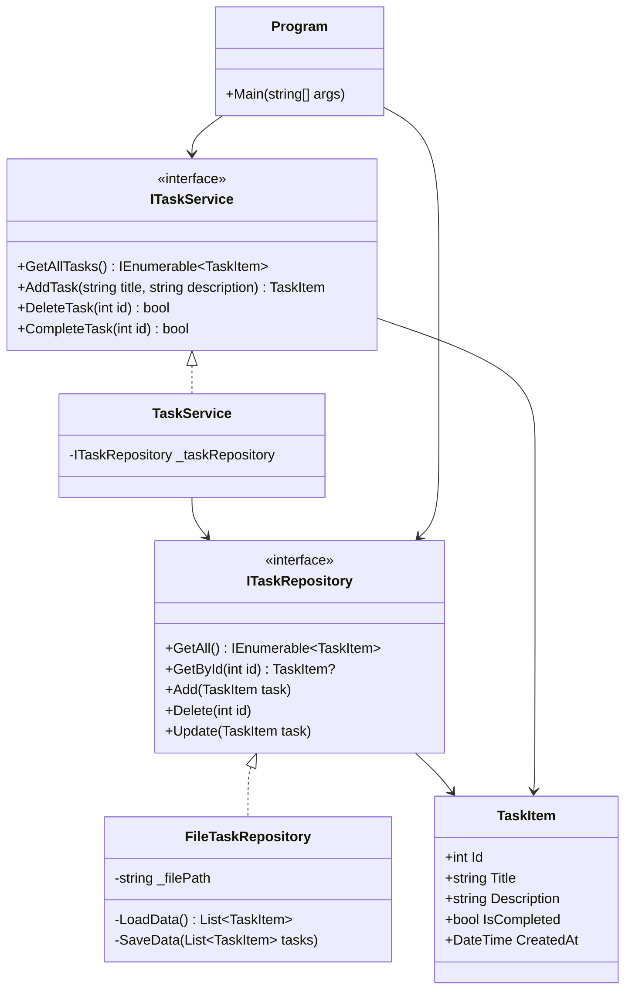

# Диаграмма классов (ЛР №1)

```mermaid
classDiagram
    class TaskItem {
        +int Id
        +string Title
        +string Description
        +bool IsCompleted
        +DateTime CreatedAt
    }

    class ITaskRepository {
        <<interface>>
        +GetAll() IEnumerable~TaskItem~
        +GetById(int id) TaskItem?
        +Add(TaskItem task)
        +Delete(int id)
        +Update(TaskItem task)
    }

    class ITaskService {
        <<interface>>
        +GetAllTasks() IEnumerable~TaskItem~
        +AddTask(string title, string description) TaskItem
        +DeleteTask(int id) bool
        +CompleteTask(int id) bool
    }

    class TaskService {
        -ITaskRepository _taskRepository
    }

    class FileTaskRepository {
        -string _filePath
        -LoadData() List~TaskItem~
        -SaveData(List~TaskItem~ tasks)
    }

    class Program {
        +Main(string[] args)
    }

    ITaskService <|.. TaskService
    ITaskRepository <|.. FileTaskRepository
    TaskService --> ITaskRepository
    Program --> ITaskService
    Program --> ITaskRepository
    ITaskRepository --> TaskItem
    ITaskService --> TaskItem
```
